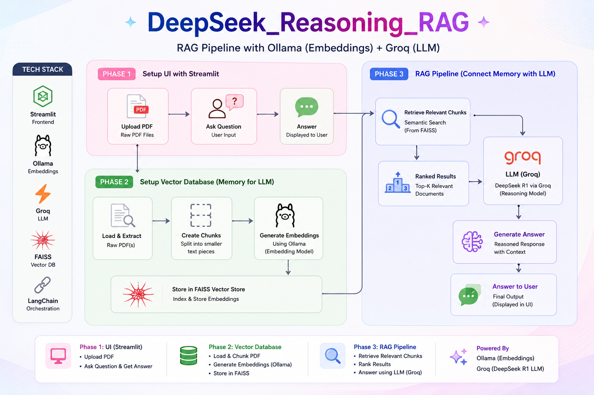

<div align="center">

# 🤖 DeepSeek Reasoning RAG

A **PDF Question-Answering** system built using **RAG (Retrieval Augmented Generation)** — upload any PDF, ask questions in natural language, and get reasoned answers powered by DeepSeek R1.

</div>




[](https://python.org)
[](https://streamlit.io)
[](https://langchain.com)
[](https://groq.com)
[](#-license)

---

## ✨ Features

- 📄 Upload any PDF document directly from the UI
- ✂️ Automatic text chunking for precise retrieval
- 🦙 Embed document content using **Ollama**
- 🗄️ Store and search embeddings with **FAISS**
- 🔍 Semantic similarity search for relevant context
- 🧠 **DeepSeek R1** reasoning via **Groq** inference
- 💬 Interactive chatbot interface built with **Streamlit**
- ⚡ Fast, local-friendly, and fully open-source stack

---

## 🏗️ Architecture

The system operates in three coordinated phases:

### Phase 1 — Streamlit UI
The user-facing layer. Upload a PDF, type a question, and receive an AI-generated answer — all in one clean interface.

### Phase 2 — Vector Database (Memory Layer)
1. Load the uploaded PDF
2. Extract raw text content
3. Split text into manageable chunks
4. Generate vector embeddings using **Ollama**
5. Store embeddings in a **FAISS** index for fast retrieval

### Phase 3 — RAG Pipeline
1. Convert the user's query into an embedding
2. Retrieve the most semantically relevant chunks from FAISS
3. Inject retrieved context into a prompt for **DeepSeek R1**
4. DeepSeek R1 reasons over the context via **Groq**
5. Return the final answer to the user

---

## ⚙️ Tech Stack

| Component         | Technology      |
|-------------------|-----------------|
| Frontend          | Streamlit       |
| LLM               | DeepSeek R1     |
| Inference Provider| Groq            |
| Embeddings        | Ollama          |
| Vector Store      | FAISS           |
| Orchestration     | LangChain       |
| Language          | Python 3.10+    |

---

## 📂 Project Structure

```text
DeepSeek_Reasoning_RAG/
│
├── pdfs/                  # Directory for uploaded PDF files
│
├── basic_frontend.py      # Minimal Streamlit UI (for testing)
├── frontend.py            # Main Streamlit application
├── main.py                # App entry point
├── rag_pipeline.py        # RAG chain: retrieval + LLM generation
├── vector_database.py     # PDF loading, chunking, and FAISS indexing
│
├── .env                   # Environment variables (not committed)
├── .gitignore
├── .python-version
├── pyproject.toml
└── README.md
```

---

## 🚀 Getting Started

### 1. Clone the Repository

```bash
git clone <your-repository-url>
cd DeepSeek_Reasoning_RAG
```

### 2. Create a Virtual Environment

```bash
python -m venv .venv
```

**Windows:**
```bash
.venv\Scripts\activate
```

**Linux / macOS:**
```bash
source .venv/bin/activate
```

### 3. Install Dependencies

Using `uv` (recommended):
```bash
uv sync
```

Or using `pip`:
```bash
pip install -r requirements.txt
```

### 4. Configure Environment Variables

Create a `.env` file in the project root:

```env
GROQ_API_KEY=your_groq_api_key_here
```

> Get your free Groq API key at [console.groq.com](https://console.groq.com)

### 5. Pull the Ollama Embedding Model

Make sure [Ollama](https://ollama.com) is installed, then pull the embedding model:

```bash
ollama pull nomic-embed-text
```

### 6. Run the Application

```bash
streamlit run frontend.py
```

Open your browser at `http://localhost:8501`.

---

## 🔄 RAG Workflow

```
PDF Upload
    │
    ▼
Load & Extract Text
    │
    ▼
Split into Chunks
    │
    ▼
Ollama Embeddings
    │
    ▼
Store in FAISS Index
    │
    ▼
User Submits Question
    │
    ▼
Embed Query (Ollama)
    │
    ▼
Retrieve Relevant Chunks (FAISS)
    │
    ▼
DeepSeek R1 via Groq
    │
    ▼
Final Reasoned Answer
```

---

## 🙌 Acknowledgements

This project is built on the shoulders of these excellent open-source tools and services:

- [Streamlit](https://streamlit.io) — effortless Python web UIs
- [LangChain](https://langchain.com) — LLM orchestration framework
- [Ollama](https://ollama.com) — local model serving for embeddings
- [Groq](https://groq.com) — blazing-fast LLM inference
- [FAISS](https://github.com/facebookresearch/faiss) — efficient similarity search by Meta
- [DeepSeek](https://deepseek.com) — powerful open reasoning model

---

## 📜 License

This project is intended for **educational and learning purposes**. Feel free to fork, modify, and build upon it.

---

> Built with ❤️ using DeepSeek R1, Groq, Ollama, FAISS, LangChain, and Streamlit.
